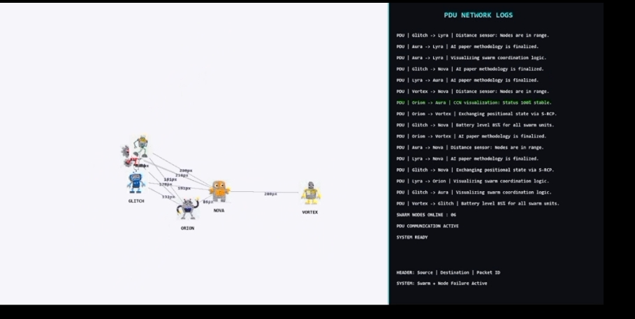

# Swarm Robot Communication Protocol (S-RCP)

A Python/Pygame simulation of a 6-node autonomous robotic swarm exchanging messages over a custom peer-to-peer communication protocol, with real-time node failure simulation.





## Overview

Six autonomous robot nodes (`Nova`, `Lyra`, `Vortex`, `Orion`, `Aura`, `Glitch`) move independently across a simulated environment. When two nodes come within communication range, a connection line is drawn between them and the live distance (in pixels) is displayed. Nodes periodically exchange data using a custom **Protocol Data Unit (PDU)** structure, and all activity is streamed to a live network log on a dashboard sidebar.

Each node also has a simulated battery that drains over time. When a node's battery drops below a threshold, it is marked as **failed**, stops moving, and is flagged in the network log — simulating real-world swarm robotics fault scenarios.

## Features

- **Custom PDU protocol** — each message carries a source, destination, randomly generated packet ID, and payload
- **Dynamic connection range** — nodes only communicate when within a defined proximity threshold
- **Real-time network log** — color-coded by event type (normal, stable, delay, node failure)
- **Battery-based node failure simulation** — nodes fail independently and are visually marked on the dashboard
- **Live dashboard UI** — split-screen layout with simulation view and scrolling PDU log

## Tech Stack

- Python 3
- Pygame

## How to Run

1. Install dependencies:
   ```bash
   pip install pygame

   nova.png  lyra.png  vortex.png  orion.png  aura.png  glitch.png
